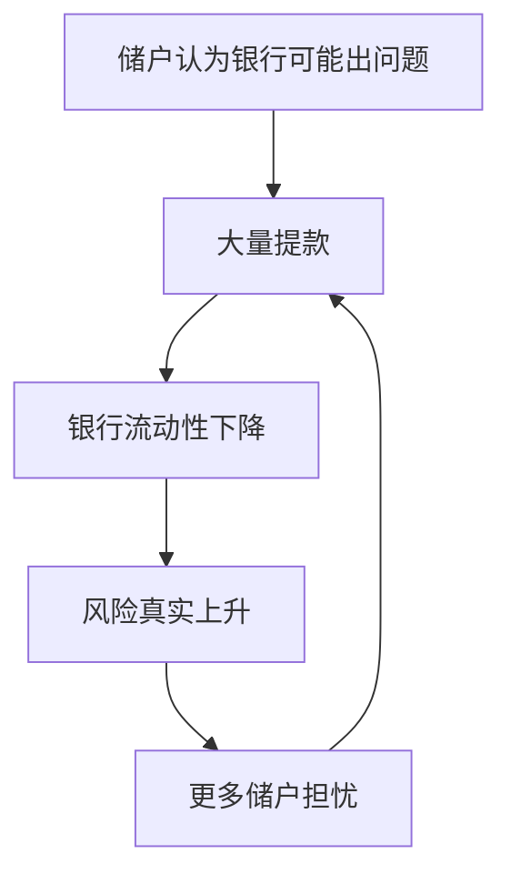
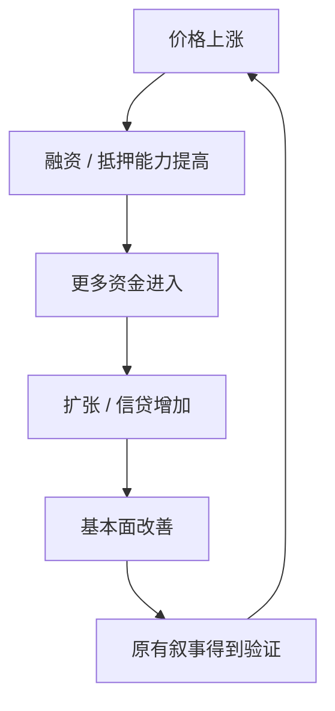
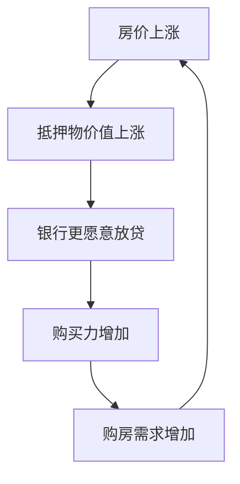
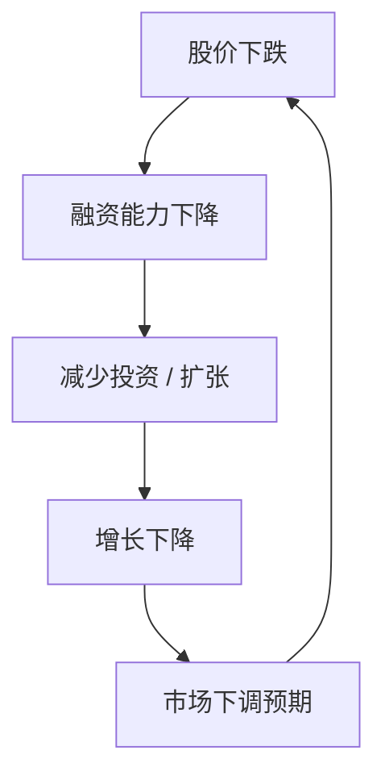
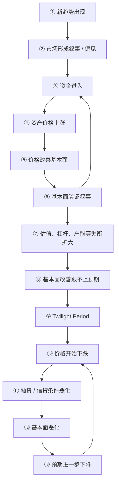
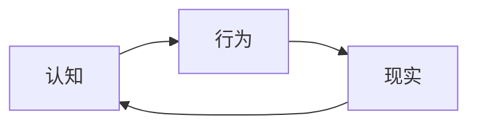

# 反身性理论（Reflexivity Theory）

> **一句话概要：** 市场参与者并非只是在观察现实；他们对现实的认知会形成行为，行为又会改变现实，新的现实再反过来修正认知。

---

## 1. 核心心智模型

传统分析经常假设：

```text
现实 / 基本面 → 人的判断 → 市场价格
```

反身性增加了一条反向因果链：

```text
人的判断 → 行为 → 市场价格 / 社会现实 → 基本面
```

因此完整结构是：


索罗斯区分两个相互作用的过程：

- **认知功能（Cognitive Function）**：现实影响参与者如何理解世界。
- **参与/操纵功能（Participating / Manipulative Function）**：参与者根据认知采取行动，行动反过来改变现实。

因此：

`Reality → Perception`

同时：

`Perception → Action → Reality`

当两条因果链同时存在时，系统就具有反身性。

---

## 2. 为什么金融市场尤其容易出现反身性？

在简单估值框架里：

`基本面 → 价格`

但金融市场中，价格本身经常可以改变基本面：

`基本面 → 价格 → 基本面`

例如一家成长公司的股价大幅上涨后，公司可能：

- 以更高估值增发融资；
- 用股票完成并购；
- 用股权激励吸引人才；
- 获得更好的债务融资条件；
- 扩大研发、销售和资本开支。

于是：

`股价上涨 → 融资能力增强 → 扩张 → 收入增长 → 市场进一步提高预期`

价格已经不只是“结果”，而成为因果链中的变量。

---

## 3. 反身性与自我实现预言

假设市场认为一家银行会出现流动性问题。



最初的判断可能并不完全正确，但参与者依据这个判断行动后，现实向判断本身靠近。

自我实现预言通常描述：

`相信 X → 行动 → X 发生`

反身性更强调持续动态反馈：

`认知(t) → 现实(t+1) → 认知(t+1) → 现实(t+2) → ...`

---

## 4. Boom–Bust：繁荣—萧条模型

反身性在金融市场中最典型的表现，是繁荣与萧条的自我强化。

### 4.1 第一阶段：趋势与偏见出现

市场首先存在某个真实趋势，例如：

- 新技术提高生产率；
- 信贷条件改善；
- 企业盈利增长；
- 房地产需求增加。

参与者围绕趋势形成解释和预期。

这里的“偏见（bias）”并不意味着完全错误，而是参与者永远无法获得完整信息，认知天然是不完备的。

---

### 4.2 第二阶段：价格开始强化基本面

资金进入后：

`需求 ↑ → 价格 ↑`

如果价格上涨进一步改善融资、抵押能力或企业经营：



这时出现关键变化：

> 市场最初的预期开始参与制造支持该预期的现实。

---

### 4.3 第三阶段：自我强化

繁荣阶段可以抽象为：

`P↑ → Fundamentals↑ → Expectations↑ → Capital Inflow↑ → P↑`

例如房地产：



房价上涨不再只是需求改善的结果，它开始制造新的购买力。

---

### 4.4 第四阶段：基本面真的越来越好

这是反身性最容易被忽略的部分。

泡沫形成过程中，基本面可能真实改善。

例如：

| 阶段 | 基本面 | 市场价格 |
| --- | ---: | ---: |
| T0 | 100 | 100 |
| T1 | 105 | 150 |
| T2 | 120 | 220 |
| T3 | 160 | 350 |
| T4 | 190 | 500 |

所以判断反身性不能只问：

> 基本面有没有改善？

还应该问：

> **基本面的改善，有多少依赖资产价格继续上涨？**

如果基本面高度依赖融资、抵押价值、财富效应或不断上涨的估值，系统就存在内生脆弱性。

---

### 4.5 第五阶段：约束开始出现

正反馈无法无限持续。

常见约束包括：

- 估值增长快于现金流；
- 债务增长快于收入；
- 房价增长快于居民购买力；
- 产能增长快于最终需求；
- 融资需求超过市场能够持续提供的资金。

系统内部逐渐形成张力。

---

### 4.6 第六阶段：Twilight Period

在繁荣后期，基本面可能仍在改善，但改善速度已经无法满足市场预期。

例如：

`Actual Fundamental Improvement < Expected Fundamental Improvement`

于是可能出现：

```text
以前：收入增长 50% → 股价大涨
后来：收入增长 50% → 股价不涨
再后来：收入增长 50% → 股价下跌
```

这意味着市场价格已经提前计入更强的未来增长。

转折并不要求基本面立即恶化，只要求：

> **现实改善的速度低于预期改善的速度。**

---

### 4.7 第七阶段：反馈方向反转

繁荣阶段：

`P↑ → F↑ → P↑`

萧条阶段：

`P↓ → F↓ → P↓`

例如：



房地产中则可能表现为：

`房价下跌 → 抵押价值下降 → 信贷收紧 → 购买力下降 → 房价进一步下跌`

同一个反馈机制开始反向运行。

---

## 5. 杠杆为什么会让反转变得剧烈？

假设：

- 资产价值：100
- 负债：80
- 净资产：20

资产价格下降 10%：

`100 → 90`

净资产变成：

`90 - 80 = 10`

资产只下降 10%，但净资产下降了 50%。

高杠杆参与者为了降低风险，被迫卖出资产：

`价格下降 → 保证金压力 → 强制卖出 → 价格继续下降`

因此非线性来自资产负债表约束，而不只是“市场情绪”。

---

## 6. 完整 Boom–Bust 回路



可以压缩为：

`偏见 → 价格 → 基本面 → 强化偏见 → 过度扩张 → 反馈失效 → 反向反馈`

---

## 7. 与博傻理论的区别

**博傻理论（Greater Fool Theory）**关注的是：

> 即使资产价格已经脱离内在价值，只要预期未来还有人愿意以更高价格接手，参与者仍可能继续买入。

它的主要机制是：

`我买入 → 因为我认为别人会以更高价格买走`

反身性则更进一步：

`买入 → 价格上涨 → 现实 / 基本面发生变化 → 更多人相信原叙事 → 继续买入`

因此两者都可以解释价格上涨，但机制不同：

| 理论 | 关注点 |
| --- | --- |
| 博傻理论 | 参与者对下一位买家的预期 |
| 反身性 | 预期、价格与基本面之间的反馈 |
| 有效市场框架 | 价格如何吸收和反映信息 |

---

## 8. 与有效市场假说的张力

有效市场分析通常强调信息如何进入价格。

反身性强调另一件事：

> **价格形成以后，还可能改变被市场用来估值的对象。**

因此不能总是假定：

`Fundamentals → Price`

有些市场更接近：

`Fundamentals ↔ Price`

例如：

- 银行资产负债表；
- 房地产抵押融资；
- 高成长公司的股权融资；
- 主权信用与融资成本；
- 流动性高度依赖市场价格的资产。

这也是反身性与格罗斯曼—斯蒂格利茨悖论等市场信息理论可以放在同一知识体系中讨论的原因：它们都在挑战“价格只是一个被动、无摩擦的信息输出”这种过度简化。

---

## 9. 投资分析中的三个问题

识别反身性结构，可以优先问：

### 1. 价格是否正在改变基本面？

如果价格上涨能直接改善融资、抵押能力、消费能力或企业扩张能力，反身性较强。

### 2. 基本面的改善是否依赖价格继续上涨？

这是判断系统脆弱性的重点。

如果：

`Price Stops Rising → Financing Weakens → Fundamentals Weaken`

那么看似独立的基本面增长可能实际上依赖资产价格。

### 3. 如果价格反转，反馈链会不会同步反转？

需要检查：

- 杠杆；
- 保证金；
- 抵押物；
- 再融资需求；
- 现金流；
- 资产负债表；
- 市场流动性。

这些变量决定“价格下跌”是否只是估值调整，还是会进一步制造基本面恶化。

---

## 10. 局限与批判性思考

反身性是解释框架，不是一个能够机械预测拐点的公式。

它可以帮助识别：

- 正反馈是否存在；
- 价格是否影响基本面；
- 系统是否依赖持续融资；
- 反馈是否开始失效；
- 反向反馈是否可能形成。

但它通常不能单独告诉我们：

- 价格何时见顶；
- 泡沫还能持续多久；
- 市场最终合理价格是多少；
- 哪个具体事件会触发反转。

因此反身性更适合作为**系统结构分析工具**，而不是精确择时模型。

---

## 11. 最终心智模型

反身性最值得记住的不是“市场会有泡沫”，而是三个因果关系：

1. **认知影响行为。**
2. **行为改变现实。**
3. **改变后的现实重新塑造认知。**

最终形成：



在金融市场里进一步表现为：


所以真正值得追问的不是：

> “市场现在是不是错了？”

而是：

> **“市场的这个判断，正在通过什么机制改变现实；这个机制又需要什么条件才能继续？”**
