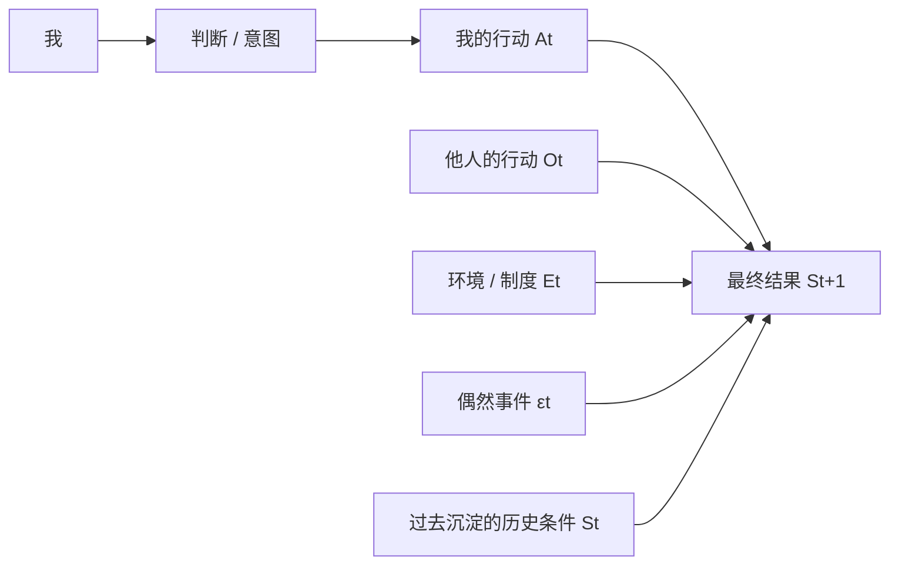
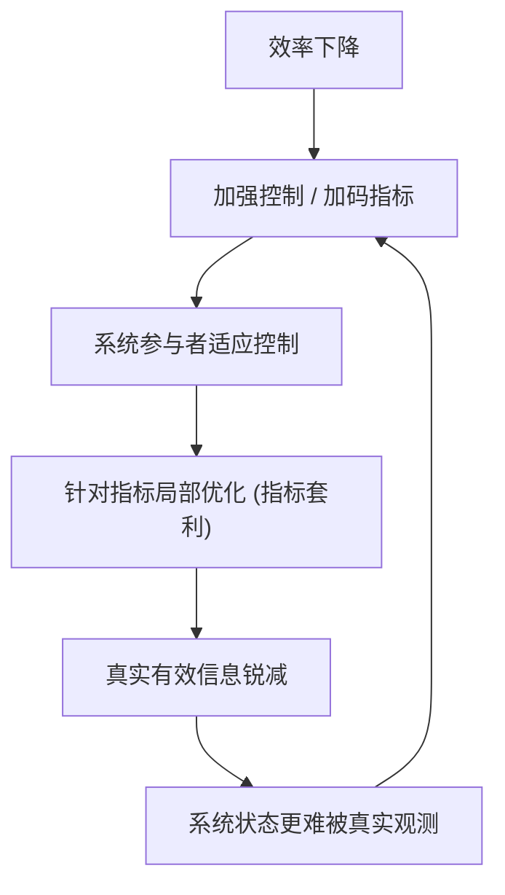
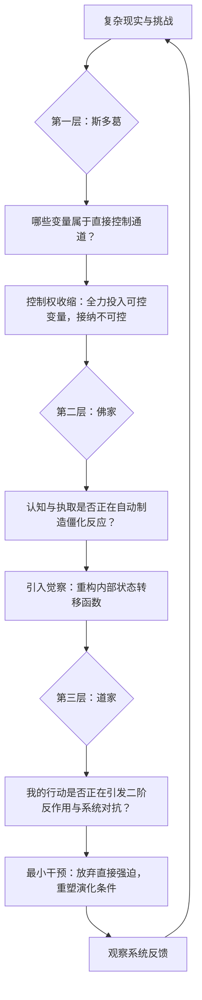
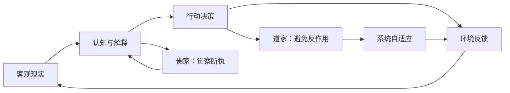

# 行动与控制的统一框架：斯多葛、佛家、道家与复杂系统

> **核心命题**：
> $$\boxed{\text{有限能动者，如何在不可完全控制的系统中行动？}}$$
> *注：佛教、道家、斯多葛主义的终极解脱目标与形而上学基础各异，本文聚焦于“行动、控制与决策”这一维度上的系统结构比较。*

---

## 1. 建立基础“控制系统”模型

假设人生与外部系统的状态演化方程为：

$$S_{t+1} = F(S_t, A_t, O_t, E_t, \epsilon_t)$$

其中：
- $S_t$：当前状态；
- $A_t$：我的行动（直接施加控制的通道）；
- $O_t$：他人的博弈与行动；
- $E_t$：客观环境、制度与物理规律；
- $\epsilon_t$：随机扰动与偶然事件。



人类痛苦和决策失误的核心根源，往往在于试图用 $A_t$ 直接硬控 $S_{t+1}$（结果）：

$$\text{我的行动} \neq \text{最终结果}$$

$$\boxed{\text{我的行动} \in \text{最终结果的生成条件之一}}$$

---

## 2. 斯多葛主义：划清控制权边界（Boundary）

斯多葛哲学（爱比克泰德、马可·奥勒留）的核心命题在于明确区分两类变量集合：

$$C = \{ \text{取决于我们的变量 / 可控集合} \}$$

$$U = \{ \text{不取决于我们的变量 / 不可控集合} \}$$

以一次重要面试或商务谈判为例：
* **相对可控（$C$）**：自身的准备程度、逻辑表达、情绪管理、准时度、专业沉淀；
* **不可完全控（$U$）**：对方的偏好偏见、竞争对手的表现、公司的隐藏 HC、外部宏观经济变化。

**策略本质**：
* 彻底接管 $\text{Control}(C)$；
* 理性接受并臣服于 $U$。

> **斯多葛解决的是“控制权配置问题”：不要把极其稀缺的控制能量，浪费在不存在控制通道的变量上。**

---

## 3. 佛家更深一步：内部状态转移与觉察（Awareness）

斯多葛划定可控与不可控后，佛教会进一步追问：**为什么我如此执著于直接控制那个结果？**

以“未获得预期晋升”为例：


佛教深刻揭示：**事件本身并不直接等于痛苦**。在事件与痛苦之间，存在一个长链条的状态转移：

$$\text{事件} \rightarrow \text{感受} \rightarrow \text{认知/解释} \rightarrow \text{渴爱/执取} \rightarrow \text{苦}$$

佛家的“觉察”绝非消极认命，而是**在刺激与反应之间创造出反思的空间**：

$$\text{Stimulus} \rightarrow \text{Awareness} \rightarrow \text{Response}$$

> **觉察的工程本质：在自动反馈链中引入监控，修改系统内部的状态转移函数。**

---

## 4. 控制行为 vs 控制反应函数：自由度的真正定义

假设遭遇他人公开挑衅或羞辱：
* **未训练系统**：$\text{羞辱} \rightarrow \text{愤怒} \rightarrow \text{反击}$，条件概率 $P(\text{反击} \mid \text{羞辱}) \approx 0.95$。这种高度自动化的反应，看似“你在行动”，实则你只是外界输入的受控傀儡。
* **经受觉察训练的系统**：$\text{羞辱} \rightarrow \text{觉察到愤怒的涌起} \rightarrow \text{评估情境} \rightarrow \text{选择最优响应}$，$P(\text{反击} \mid \text{羞辱})$ 降至可控区间。

由此推导出**自由（Freedom）**的现代工程定义：

$$\boxed{\text{自由度} \approx \text{给定外部刺激后，可供选择的响应空间}}$$

> **自由不是“我想要什么世界就必须给什么”，而是“世界给我一个输入，我不再只有唯一的自动输出”。**

---

## 5. 道家换了一个更高维度的问题：系统的反作用（Feedback）

* 斯多葛问：**什么归我控制？**
* 佛家问：**为什么我的心被这个输入自动驱动？**
* 道家则追问：**你为什么假设这个系统需要这么多强力控制？**

**管理与工程中的典型反例**：
效率下降 $\rightarrow$ 引入严苛 KPI $\rightarrow$ 员工适应指标并开展指标套利 $\rightarrow$ 真实信息被隐藏 $\rightarrow$ 组织底层效率进一步恶化 $\rightarrow$ 引入更密集的控制。



道家指出：**控制本身就是反馈回路的一部分，强力干预必将引发系统的反向自适应。**

---

## 6. “无为”的工程化理解：最小必要干预与管理条件（Leverage）

复杂自适应系统中充斥着：

$$\text{Intervention} \rightarrow \text{Adaptation} \rightarrow \text{Unintended Side Effects}$$

因此，更多控制 $\not\Rightarrow$ 更好结果。

**园艺隐喻**：
你无法命令一颗种子“立刻长高两米”。你唯一能做的，是管理其外部约束条件：

$$\text{水分} + \text{光照} + \text{土壤养分} + \text{通风温度} \rightarrow \text{创造生长条件} \implies \text{系统自行演化涌现}$$

> **“无为”绝非不行动，而是放弃对结果的单点强行霸凌，转向对系统生成条件的低能耗调控。**

---

## 7. 三大思想的统一结构层级



| 层级 | 核心问题 | 对应思想 | 系统工程映射 |
|---|---|---|---|
| **控制边界** | 什么真正归我控制？ | **斯多葛** | 明确输入集合（$A_t \subset S_{t+1}$），切断对外部变量的虚妄控制 |
| **内部反馈** | 什么在自动驱动我的反应？ | **佛家** | 观测并解耦内部自动回路，重构状态转移函数 |
| **系统反馈** | 我的行动会引发什么反作用？ | **道家** | 识别系统自适应与二阶效应，追求最小必要干预 |

---

## 8. 反身性闭环：观察者即参与者

认知不是孤立的旁观者，认知通过行为改变现实，现实反过来校准认知：



* **反身性**：认知 $\leftrightarrow$ 现实的双向因果闭环；
* **斯多葛**：在因果流中识别哪些节点具有有效控制权；
* **佛家**：在输入与输出之间建立觉察空间，断开执取与盲动；
* **道家**：在输出与环境之间识别反作用，避免让解决方案成为问题本身。

---

## 9. 复杂系统的四步行动算法（BAFL）

面对复杂决策与人生困局，可执行以下四步工程算法：

```text
Step 1: Boundary (边界)  --> 哪些变量属于我？把行动与最终结果解耦。
Step 2: Awareness (觉察) --> 我当前是被刺激驱动，还是自主选择？重构反应空间。
Step 3: Feedback (反馈)  --> 这个行动会引发系统的何种自适应与二阶副作用？
Step 4: Leverage (杠杆点)--> 放弃暴力单点控制，寻找让系统自组织演化的高杠杆条件。
```

---

## 10. 终极心智模型：智慧的工程定义

$$\boxed{Wisdom = Boundary + Awareness + Feedback + Leverage}$$

* **斯多葛告诉你**：不要去控制你控制不了的东西；
* **佛家进一步追问**：那个执著要控制一切的“我”是谁？觉察它，打碎自动反应的枷锁；
* **道家终极提醒**：即使你拥有控制能力，也要敬畏系统的反馈，不要让你的干预变成系统灾难的源头。

$$\boxed{\text{你不能直接控制整个状态空间，但可以重构自身的状态转移函数，并极其审慎地调整局部反馈结构。}}$$
