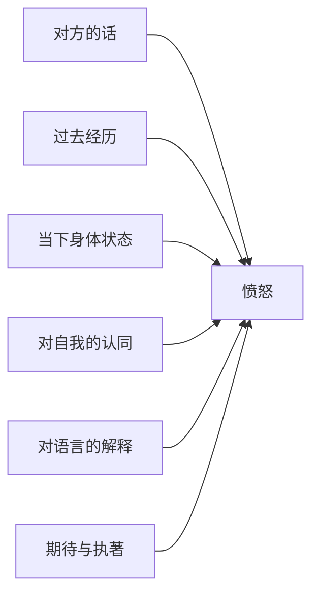
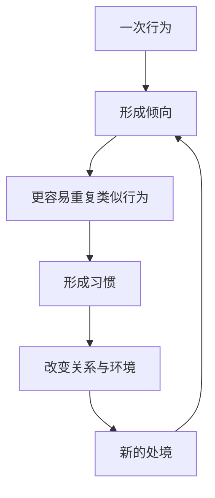
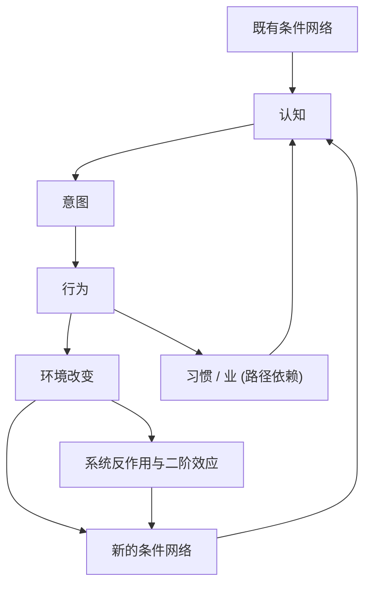
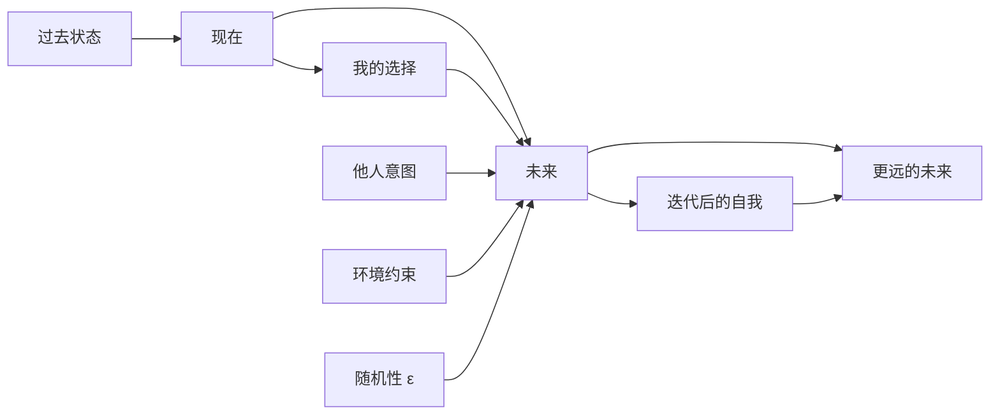

# 缘起、反作用与反身性：佛道因果观与控制力施加

> **核心命题**：市场的反身性表征为“认知 $\rightarrow$ 行为 $\rightarrow$ 现实 $\rightarrow$ 新认知”；而佛家与道家皆非线性因果论，佛教的“缘起”与道家的“相生转化/反作用”，深刻揭示了在复杂因果网络中“控制力应施加于何处”的工程本质。

### 核心坐标系对比

| 思想维度 | 更关心的问题 | 基本结构 |
|---|---|---|
| **普通因果论** | A 会不会导致 B？ | $A \rightarrow B$ |
| **佛家缘起** | B 是依赖哪些条件形成的？ | $A + B + C + \cdots \rightarrow B'$ |
| **道家思维** | A 与 B 如何相生、转化、反作用？ | $A \leftrightarrow B$ |
| **反身性** | 人对 B 的认识会不会反过来改变 B？ | 认知 $\rightarrow$ 行为 $\rightarrow$ 现实 $\rightarrow$ 认知 |

---

# 一、佛家的重点其实不是“因果”，而是“缘起”

日常说“佛教讲因果”，容易让人联想到朴素版本：

> 做好事 $\rightarrow$ 得好报  
> 做坏事 $\rightarrow$ 得恶报

佛教更基础的概念是**缘起（pratītyasamutpāda）**。它关心的不是“这个结果是谁造成的？”，而更接近：

> **“什么条件同时成立时，这个现象才会出现？”**

数学化抽象为：

$$Result = F(C_1, C_2, C_3, \ldots, C_n)$$

例如一个人今天非常愤怒：
* **朴素因果**：别人骂我 $\rightarrow$ 我生气
* **缘起视角**：

同一句话对不同的人产生不同结果，说明：

$$\text{刺激} \neq \text{结果}$$

更接近于：

$$\text{刺激} + \text{内部状态} + \text{条件网络} \rightarrow \text{结果}$$

这正是现代复杂系统里的**状态依赖（State Dependence）**。

---

# 二、那么佛家的“业”是什么？

如果把“业”理解成宇宙里有一个自动记账系统（做坏事扣分、未来安排恶果），就会沦为机械决定论。

“业”的原义与**有意志的行为（karma）**密切相关。一个行为发生后，会成为未来条件的一部分：
* 第一次撒谎，可能没有明显外在后果；
* 但该行为会留下内部状态：心理阻力降低 $\rightarrow$ 下一次更容易撒谎；
* 重复撒谎 $\rightarrow$ 固化为行为模式 $\rightarrow$ 他人逐渐不信任 $\rightarrow$ 人际与环境结构改变。

从系统论视角看，“业”本质上是：

> **行为修改了系统状态，而新的状态改变下一次状态转移的概率。**

即系统科学中的 **路径依赖（Path Dependence）**。

---

# 三、这样理解以后，“因果”就不是宿命论了

假设系统的演化方程为：

$$S_{t+1} = F(S_t, A_t, E_t)$$

过去行为限制并塑造了现在的 $S_t$，但现在的选择与行为 $A_t$ 仍然是生成下一状态 $S_{t+1}$ 的关键输入：

> **过去限制了你，但过去没有单独决定你。**

如果一切都已经被过去的业严格决定（即 $\text{未来} = f(\text{过去})$），那么当下的修行和努力将毫无意义。正因为：

$$\text{未来} = f(\text{过去状态}, \text{当前行为}, \text{当前条件}, \ldots)$$

改变当前条件才有决定性的力量：

---

# 四、佛家最深的一步其实是：“我”也在因果网络里面

普通人的默认心智模型是“二元对立”的：

$$\text{一个固定的“我”} \quad \text{vs} \quad \text{外在客观世界}$$

佛教会进一步追问：**这个“我”本身是否也是条件组合涌现而成的？**

$$\text{性格} = \text{遗传} + \text{成长经历} + \text{记忆} + \text{习惯} + \text{社会关系} + \text{生理状态} + \text{长期认知模式} + \cdots$$

于是：

$$\text{我} = \text{Process（过程与流动）} \quad \neq \quad \text{固定实体}$$

这连接了“无我”与“缘起”：
> **因为事物完全依赖条件而存在，所以不存在一个脱离条件、永恒不变的独立自我。**

就像流体中的**漩涡**：漩涡看起来是一个稳定存在的东西，但漩涡并不等于某一批固定的水分子，它只是**持续流动中维持的稳定耗散结构**。人也是如此——“我”是持续迭代、具有历史连续性的演化过程。

---

# 五、道家的方向：关系性思维与转化

道家没有建立“业—缘起—轮回”的繁复概念，它更关注：**事物如何在相互关系中定义，又如何向反面转化。**

《道德经》云：“有无相生，难易相成，长短相形，高下相倾。”其底层逻辑不是单向的 $A \rightarrow B$，而是双向依存的：

$$A \leftrightarrow B$$

“长”必须相对于“短”才能获得意义。没有“短”，“长”的概念本身就不复存在：

$$A\text{的属性与意义} = f(A\text{与}B\text{的关系})$$

---

# 六、道家特别敏感的是“反作用”与二阶效应

> **你越想强行控制一个系统，系统越容易产生反向抵抗。**

例如管理系统中的典型案例：
1. 组织为了提高效率，增加 KPI 考核；
2. 员工开始适应指标，针对指标进行局部优化与指标套利，真实目标被异化置换；
3. 指标越来越漂亮，真实系统越来越脆弱（**古德哈特定律，Goodhart's Law**）。

道家极其敏锐地指出：**你的行动本身会改变行动所面对的对象**。

$$\text{干预} \rightarrow \text{系统自适应调整} \rightarrow \text{原始干预失效/恶化}$$

---

# 七、“无为”不是不行动，而是不制造多余的因果链

从复杂系统与工程架构视角理解“无为”极其清晰：

现实中，系统里一半以上的问题，往往是为了解决上一次解决方案所引入的问题：

$$\text{Bug} \rightarrow \text{Patch} \rightarrow \text{新的Coupling} \rightarrow \text{新Bug} \rightarrow \text{更多Patch} \rightarrow \text{系统僵死}$$

道家式的问题绝非“为什么不作为”，而是：

> **“你的解决方案本身，是否正在成为问题的一部分？”**

---

# 八、三者交汇：反身性、缘起与无为的系统图景

* **反身性**：认知 $\rightarrow$ 行为 $\rightarrow$ 现实 $\rightarrow$ 认知
* **道家**：行动 $\rightarrow$ 环境反作用 $\rightarrow$ 新条件 $\rightarrow$ 行动
* **缘起**：条件网络$_t \rightarrow$ 现象$_t \rightarrow$ 条件网络$_{t+1}$

* **佛家关注**：$\text{条件} \rightarrow \text{认知/行为} \rightarrow \text{新条件}$
* **道家关注**：$\text{行为} \rightarrow \text{反作用} \rightarrow \text{相生转化}$
* **反身性关注**：$\text{认知} \rightarrow \text{行为} \rightarrow \text{现实} \rightarrow \text{认知}$

---

# 九、终极工程分歧：控制力施加在何处？

佛家与道家虽然共享非线性因果视角，但应对策略大相径庭：

### 1. 佛家的策略：修改状态转移函数
佛家追问：**这个循环为什么持续产生痛苦？怎样切断维持循环的自动条件？**

$$\text{感受} \rightarrow \text{渴爱} \rightarrow \text{执取} \rightarrow \text{盲动} \rightarrow \text{新的苦}$$

修行的工程本质是：**在自动反馈链中引入“觉察”，使默认状态转移解耦**：
* 原始：$\text{刺激} \rightarrow \text{愤怒} \rightarrow \text{攻击}$
* 引入觉察：$\text{刺激} \rightarrow \text{觉察} \rightarrow \text{愤怒存在} \rightarrow \text{不触发攻击}$

从而大幅降低条件概率 $P(\text{攻击} \mid \text{愤怒})$。**修行，即在内部重构系统的状态转移函数。**

### 2. 道家的策略：顺应系统自身动力学
道家追问：**为什么非要强迫系统按照主观意志运行？**
* 批判：$\text{欲望} \rightarrow \text{控制} \rightarrow \text{反作用} \rightarrow \text{更强控制}$
* 策略：$\text{观察结构} \rightarrow \text{减少不必要干预} \rightarrow \text{借力系统自身趋势（顺势）}$

---

# 十、命运的重定义：约束下的生成

$$\boxed{\text{命运不是因果链，而是因果网络在时间上的展开}}$$

两个极端推论皆不成立：
* **宿命论**（过去已严格锁死未来）——忽略了当前行为与认知作为实时输入的生成能力；
* **唯意志论**（我想怎样就能怎样）——忽略了既有状态、环境反作用与因果网络的刚性约束。

$$\boxed{\text{未来} = \text{约束下的动态生成}}$$

由此推导关于**自由**的工程定义：

> **自由不是脱离因果，而是在透彻理解因果网络后，逐渐获得修改某些反馈回路与状态转移函数的能力。**

佛家的“觉察”、道家的“无为”与斯多葛主义的“控制二分法”，本质上是在回答同一个终极问题：**在一个你无法完全掌控的复杂自适应系统中，究竟应该把稀缺的控制力施加在哪里。**
