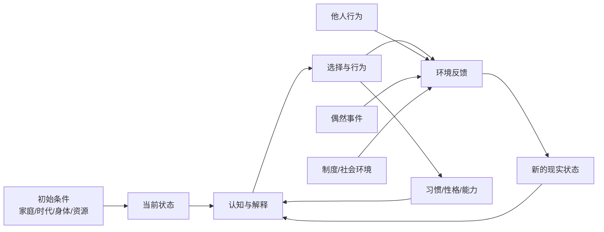
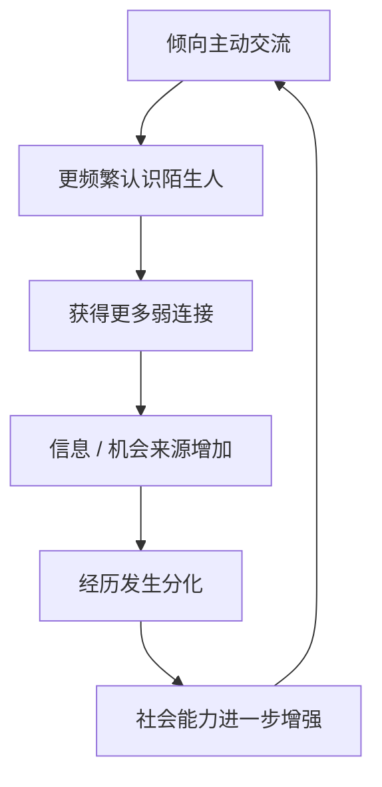
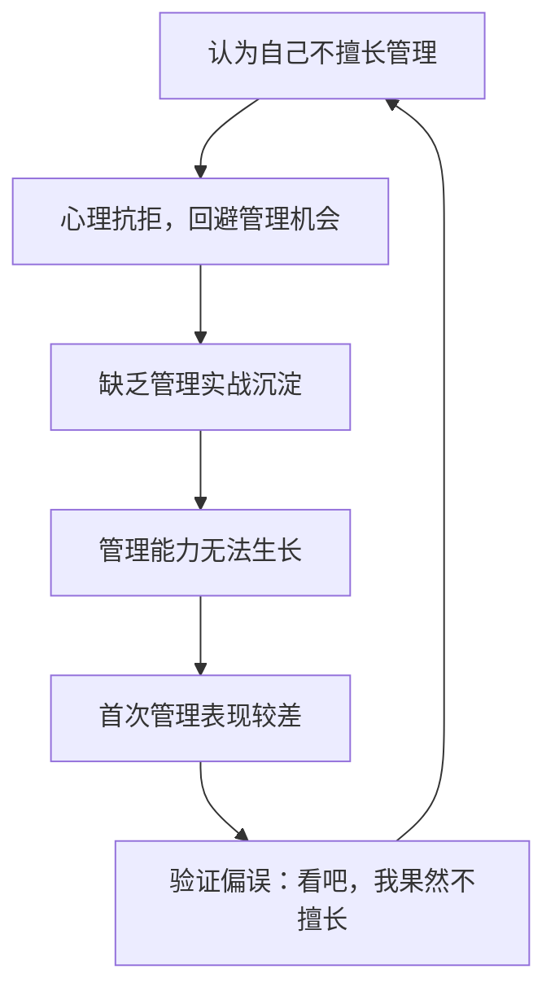
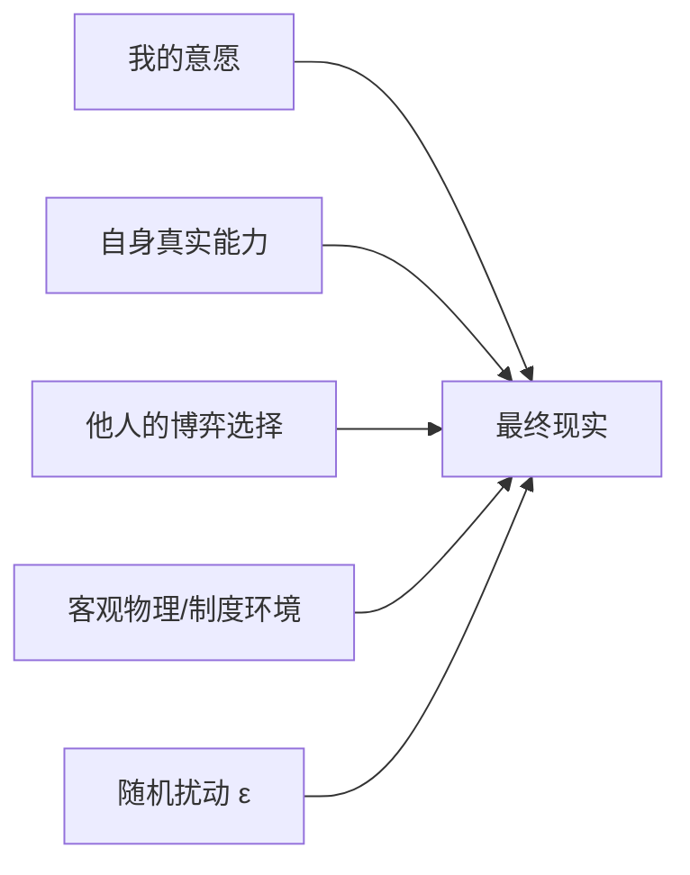

# 命运作为动态生成过程：缘起、道家无为与系统建模

> **核心洞察**：把“命运”暂时去掉神秘主义含义，定义为一个人未来实际经历的人生轨迹——那么它不像一条已经写好的线，更像一个具有初始条件、路径依赖、反馈回路、随机扰动和有限能动性的动态系统。

---

## 1. 佛教：命运更接近“缘起”，而不是宿命

如果用现代系统语言翻译“缘起”，可以写成状态演化方程：

$$S_{t+1} = F(S_t, A_t, E_t)$$

其中：
- $S_t$：当前的内部状态；
- $A_t$：当下的选择与行为；
- $E_t$：外部环境与条件；
- $S_{t+1}$：下一阶段生成的新状态。

今天的你，是过去大量条件共同作用的结果；今天的行为，又成为明天的条件。

因此：

$$\text{过去} \rightarrow \text{现在的认知} \rightarrow \text{现在的行为} \rightarrow \text{改变未来条件} \rightarrow \text{新的认知} \rightarrow \cdots$$

**“过去影响现在”绝不等于“过去决定未来”。**

例如一个人小时候形成信念：“失败意味着我没有能力。”

$$\text{失败} \rightarrow \text{自我否定} \rightarrow \text{回避挑战} \rightarrow \text{缺少训练} \rightarrow \text{能力增长缓慢} \rightarrow \text{更多失败}$$

这是一种自我强化的“业”回路。用现代系统科学视角：

> **历史行为留下的状态变量，会持续影响系统未来的转移概率。**

---

## 2. “业”可以类比为系统的路径依赖（Path Dependence）

假设两个人表面状态完全相同：

$$S_t = 100$$

但内部历史积累的状态变量迥异：
* **个体 A**：过去十年形成了稳定的学习习惯与复盘韧性；
* **个体 B**：过去十年形成了遇到困难就逃避的防御机制。

面对同一个事件（例如：项目遭遇重大失败）：

$$F_A(\text{失败}) \neq F_B(\text{失败})$$

* **个体 A**：$\text{失败} \rightarrow \text{分析} \rightarrow \text{调整} \rightarrow \text{继续}$
* **个体 B**：$\text{失败} \rightarrow \text{恐惧} \rightarrow \text{逃避} \rightarrow \text{停止}$

**真正决定未来轨迹的，不仅是“发生了什么”，更是“系统已被过去塑造成了什么结构”。**

过去虽然已经消失，但留下了不可磨灭的状态变量（State Variables）：
* 习惯与技能
* 财富与隐形债务
* 人际网络与声誉
* 生理状态与创伤记忆
* 信念体系与面对刺激的默认反应模式

---

## 3. “性格决定命运”的系统论重释

宿命论对这句话的理解是：*“你是什么性格，所以注定有什么人生。”*

系统论视角则完全不同：

$$\text{性格倾向} \rightarrow \text{特定行为出现概率提高} \rightarrow \text{长期重复} \rightarrow \text{环境反馈累积} \rightarrow \text{人生轨迹分布偏转}$$

这里不存在机械线性的“外向 $\Rightarrow$ 成功”，而是：

$$\boxed{\text{命运不是确定点预测 } Future = X\text{，而是一个条件概率分布 } P(Future \mid State, Behavior, Environment)}$$

---

## 4. 反身性出现：预测自我并参与制造现实

人类系统包含一个极具自指性的变量：**我们会预测自己的未来，而该预测会反过来重塑现实。**

一个人如果坚信：*“我以后一定做不好管理。”*

许多人感叹的“我的命就是这样”，本质上是**对命运的负向判断深度参与了这条命运的制造过程**。

---

## 5. 警惕滑向“唯意志论”：受约束的能动性

反身性（认知 $\rightarrow$ 行为 $\rightarrow$ 现实）绝不等于虚无缥缈的“吸引力法则”或“心想事成”。

相信自己会暴富，银行账户不会自动增加，因为现实结果受到刚性多元约束：

$$Outcome = F(InitialConditions, Behavior, Others, Institutions, Resources, Randomness)$$

因此该模型兼具批判性：
* **既破除了“一切注定”的宿命论**；
* **也摒弃了“心念即现实”的狂妄唯意志论**；
* 确立了**受客观约束的有限能动性（Constrained Agency）**。

---

## 6. 道家“无为”：避免强控引发的二阶反作用

“无为”绝非消极怠工，其复杂系统本质是：**不要假设复杂自适应系统能被单点意志完全控制。**

在复杂系统中，干预往往引发反向自适应：

$$Intervention \uparrow \implies Adaptation \uparrow \implies Unexpected\ Consequences \uparrow$$

**典型教育与管理案例**：
为了让孩子或员工自律，不断加强单向监督（监督 $\uparrow \rightarrow$ 外部约束 $\uparrow$）。系统中的人迅速适应并进化出规避策略（规避 $\uparrow$），倒逼更严苛的监控，最终培养出的不是自律的主体，而是**擅长规避监管的套利者**。

因此“无为”引导的核心问题是：

> **我应该直接控制结果，还是改变产生结果的土壤与条件？**

---

## 7. 思想交叉坐标

| 思想维度 | 观察与洞察焦点 |
|---|---|
| **佛教缘起** | 结果源于条件网络，非孤立单因 |
| **业（Karma）** | 过去行为沉淀为塑造未来的状态变量与路径依赖 |
| **无常** | 系统状态在时间轴上持续动态更新 |
| **道家思维** | 敏感于关系定义、相生转化与自适应反作用 |
| **无为** | 避免违背系统动力学的单点强行干预，借力顺势 |
| **反身性** | 认知通过决策与行为参与制造现实结果 |
| **复杂系统** | 反馈回路、非线性因果、涌现与扰动 |

最终共同指向：

$$\boxed{\text{未来既非完全确定，也非绝对自由，而是在既有约束下持续生成的}}$$

---

## 8. “命”与“运”的现代系统论定义

* **命**：当前时点无法立即改变的状态变量集合（初始条件与刚性约束）：
  $$M_t = \{ 出生条件, 过去经历, 生理基础, 已有资源, 时代背景, 既有关系 \}$$
* **运**：系统在时间轴上推进的状态转移轨迹：
  $$S_t \rightarrow S_{t+1} \rightarrow S_{t+2} \rightarrow \cdots$$

将选择作为输入变量引入：

$$\boxed{S_{t+1} = F(S_t, A_t, E_t, \epsilon_t)}$$

当前形成的“命”（$S_t$）作为约束，结合你的选择（$A_t$）、外部环境（$E_t$）与不可抗的随机性（$\epsilon_t$），共同生成下一阶段的你（$S_{t+1}$）。

---

## 9. 自由存在于何处？

人通常无法直接操纵最终结果，真正的自由在于：

$$\boxed{\text{在当前约束条件下，改变下一次状态转移函数的能力}}$$

* 一次细微的选择改变（$A_1 \rightarrow S_2$），短期看似波澜不惊；
* 但新的状态会持续迭代后续选择（$A_2 \rightarrow S_3$）；
* 长期迭代至 $S_{100}$ 时，系统相空间可能已彻底远离原始的锁定轨迹。

> **路径依赖既意味着过去约束现在，也意味着当下正在亲手编写通往未来的路径依赖。**

### 终极方法论
**人无法直接扭转“命运”，但可以重塑生成命运的底层反馈回路。**

与其盲目立誓“我要成功”，不如深入系统底层探寻：

$$\text{什么行为} \rightarrow \text{什么环境反馈} \rightarrow \text{强化什么能力} \rightarrow \text{提高什么正向行为的概率}$$

一旦识别并闭合了这条正反馈循环，人生就从一个玄学的宿命命题，变成了一个**自适应动态系统的架构工程**。
