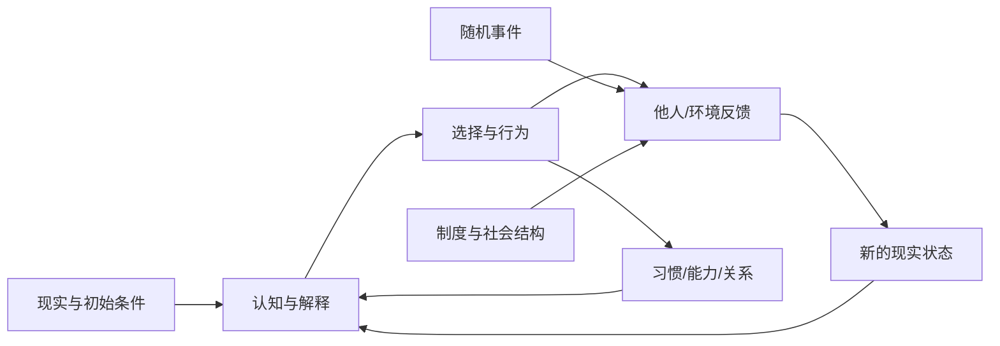
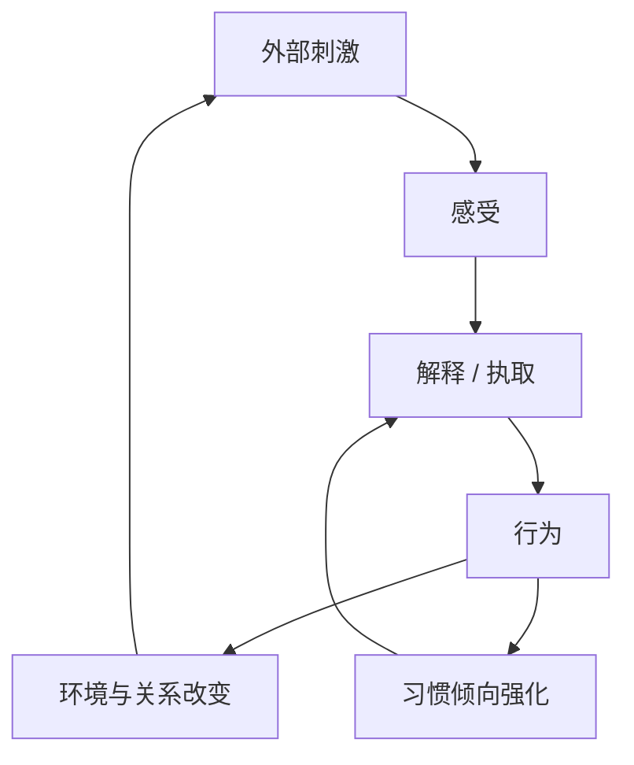
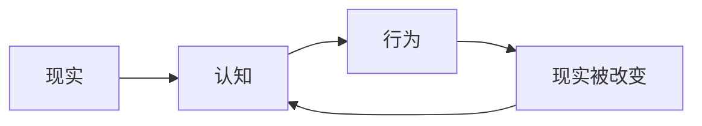
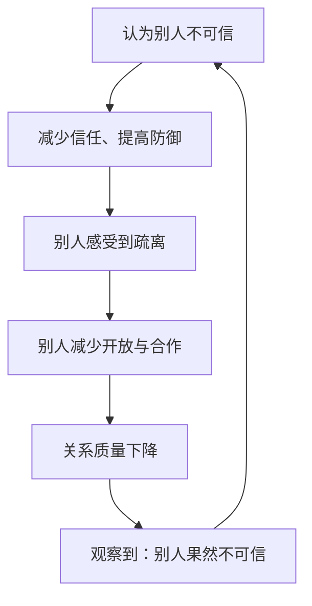
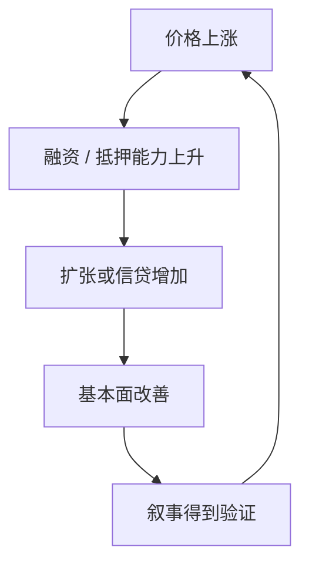
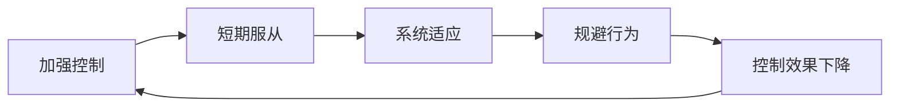
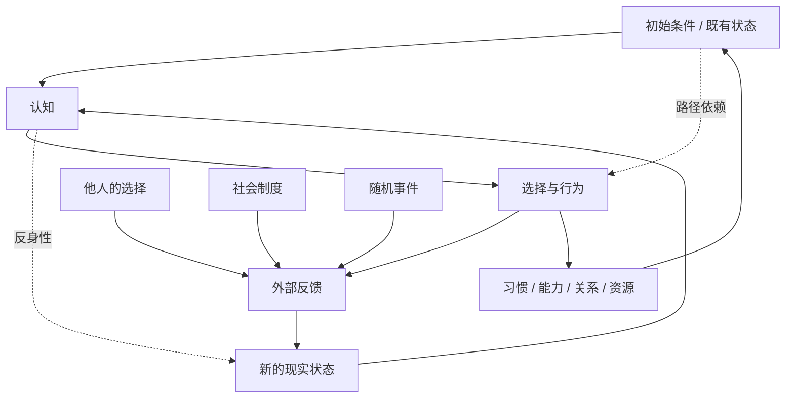

# 命运作为动态反馈系统：缘起、无为、反身性与复杂系统

> **一句话概要：** 与其把“命运”理解为一条预先写好的因果链，不如把它理解为一个受初始条件约束、被认知与行为持续改写、同时受到他人、环境和随机事件影响的动态系统。

---

## 1. 核心问题：命运是因果链，还是反馈系统？

传统直觉容易把因果理解成：

```text
原因 A → 结果 B
```

这种线性因果在物理事件中很有用，但人的生活往往不是这样。人的认知会影响行为，行为会改变环境，改变后的环境又会反过来重塑认知。



一个简单的系统表达是：

`S(t+1) = F(S(t), A(t), E(t), ε(t))`

其中：

- `S(t)`：当前状态；
- `A(t)`：当前选择与行为；
- `E(t)`：外部环境、制度与他人行为；
- `ε(t)`：随机扰动；
- `S(t+1)`：下一时刻的状态。

新的状态又会成为下一轮的起点，所以人的人生轨迹更像：

`S0 → S1 → S2 → ...`

---

## 2. 佛教缘起：结果来自条件网络，而非单一原因

佛教“缘起”可以用现代系统语言理解为：任何现象都依赖一组条件共同出现，不应把复杂结果归结为一个孤立原因。

例如：

`外部刺激 + 过去经验 + 身体状态 + 当前认知 + 执取 → 情绪反应`

但人的情绪反应又会改变环境：

`情绪 → 言语和行为 → 他人的反应 → 关系环境 → 下一轮情绪`



这说明“因果”在现实生活中经常不是一条线，而是一个条件网络和反馈回路。

### 2.1 “业”可以类比为路径依赖

这里是类比，不是概念等同。

过去行为虽然已经结束，但它会留下大量状态变量：

- 习惯；
- 技能；
- 财富与债务；
- 关系；
- 声誉；
- 身体状态；
- 信念；
- 经验结构；
- 对刺激的默认反应模式。

这些变量会改变以后面对同一事件时的状态转移函数。

即使两个人当前看起来处于相同位置，只要他们过去形成的内部结构不同，面对同一事件也可能进入完全不同的后续轨迹。

因此，过去并不是通过“神秘力量”决定未来，而是通过已经写入系统的状态继续起作用。

---

## 3. 反身性：认知不仅描述现实，也参与制造现实

乔治·索罗斯的反身性理论提出一个重要区别：

`Reality → Perception`

现实会影响认知。

同时：

`Perception → Action → Reality`

认知也会通过行为反过来改变现实。

完整结构是：



### 3.1 一个生活中的例子

假设一个人相信：

> “别人不值得信任。”

这不是单纯的思想内容。这个信念会改变他的行为：



于是，一个原本只有部分真实性的判断，可以通过行为逐渐制造出更支持该判断的现实。

所以在人类系统中，必须同时问两个问题：

1. 我的判断是否正确描述现实？
2. 我的判断正在制造怎样的现实？

第二个问题，就是反身性的核心。

---

## 4. 繁荣—萧条模型：反身性如何形成自我强化

在金融市场中，反身性会形成典型的正反馈：

`价格上涨 → 融资能力提高 → 基本面改善 → 市场预期进一步改善 → 价格继续上涨`



这时，价格不再只是基本面的结果，价格本身成为基本面的原因之一。

但这种循环不能无限维持。当估值、杠杆、收入、产能或现金流之间的约束开始失衡，系统会进入反向反馈：

`价格下跌 → 融资能力恶化 → 基本面恶化 → 预期下降 → 价格继续下跌`

这说明复杂系统中常见的现象不是“一个原因导致一个结果”，而是反馈方向发生切换。

---

## 5. 道家“无为”：复杂系统中避免过度控制

“无为”不应简单理解为“什么都不做”。

从复杂系统角度，可以把它理解为：

> 不假设复杂系统能够被单点意志完全控制；干预之前，要考虑系统的适应、反作用和二阶效应。

例如，对一个孩子持续增加监督：

`监督 ↑ → 外部约束 ↑`

短期可能提高服从。

但系统中的人会适应：

`监督 → 规避 → 更强监督 → 更复杂规避`

最终可能培养出的不是“自律”，而是“逃避监督的能力”。



因此，在复杂系统里，比“如何直接控制结果”更重要的问题是：

> 如何改变产生结果的条件？

这与道家思想中的顺势、减损和避免强制性干预，可以形成有意义的类比。

---

## 6. 四套思想的交汇点

它们不能被简单视为同一个理论，但可以在系统层面形成对应关系。

| 思想 | 主要关注点 | 系统论对应 |
| --- | --- | --- |
| 佛教缘起 | 现象依条件而生 | 条件网络、多变量因果 |
| 业 | 过去行为塑造未来条件 | 路径依赖、状态变量 |
| 无常 | 状态持续变化 | 动态系统 |
| 道家 | 关系、转化、反作用 | 系统耦合、二阶效应 |
| 无为 | 避免逆系统结构强控 | 最小干预、顺应约束 |
| 反身性 | 认知通过行为改变现实 | 内生反馈 |
| 复杂系统 | 反馈、非线性、涌现 | 动态系统总框架 |

共同指向的不是“世界完全被决定”，也不是“人可以随意创造现实”，而是：

> **未来是在既有约束下持续生成的。**

---

## 7. “命”与“运”的一个系统论重定义

这里不是在断言古代概念的原义，而是给出一个现代分析框架。

### 7.1 命：当前不能立即改变的状态变量

可以定义为：

`M(t) = {出生条件, 过去经历, 当前身体, 已有资源, 时代环境, 既有关系}`

这些变量在当前时点构成约束。

### 7.2 运：状态随时间的演化过程

`S(t) → S(t+1) → S(t+2) → ...`

“选择”只是这个系统中的一个输入，而不是全部。

`S(t+1) = F(S(t), A(t), E(t), ε(t))`

这里同时包含：

- 已经形成的“命”；
- 当前的行动；
- 环境；
- 他人的选择；
- 偶然事件。

这比“命运已经注定”和“人定胜天”都更接近复杂现实。

---

## 8. 自由存在于哪里？

如果结果无法完全控制，那么自由不是：

`我决定最终结果`

更接近：

> **我能够改变下一次状态转移。**

也就是说，一个人真正拥有的能动性，是在当前约束下改变自己的反应函数。

例如：

`失败 → 逃避`

可以逐步变成：

`失败 → 复盘 → 调整 → 再次尝试`

一次改变不一定产生明显结果，但每一次状态转移都会改变下一轮的初始条件。

长期以后，新的状态可能已经与原来的轨迹明显分离。

这就是路径依赖的另一面：

> 过去塑造现在，而现在也正在制造未来的路径依赖。

---

## 9. 一个统一模型：命运是被持续写入的反馈系统

可以把整套思想压缩成下面的结构：



统一表达可以写成：

`S(t+1) = F(S(t), Belief(t), Action(t), Environment(t), Others(t), ε(t))`

而认知本身也在更新：

`Belief(t+1) = G(S(t+1), Belief(t))`

于是系统形成闭环：

`状态 → 认知 → 行为 → 新状态 → 新认知`

---

## 10. 实践：不要直接改“命运”，要改反馈回路

如果接受这个模型，那么很多问题的分析方法会发生变化。

### 10.1 不问“我会不会成功”

改问：

- 我当前处于什么状态？
- 哪些变量是短期不可改变的？
- 哪些变量具有高杠杆率？
- 我的认知正在产生什么行为？
- 这些行为获得什么环境反馈？
- 哪些反馈正在自我强化？
- 哪些循环需要被中断？
- 哪些正向循环值得建立？

### 10.2 不直接追结果，先找回路

例如：

`学习 → 能力提高 → 解决更难问题 → 获得更好的反馈 → 更愿意学习`

这是正反馈。

反过来：

`失败 → 自我否定 → 回避 → 能力停滞 → 再次失败`

也是正反馈，只是方向不利。

因此真正值得干预的是：

> 哪个节点最容易改变整个循环？

---

## 11. 三个判断问题

面对任何人生、组织或市场现象，可以先问：

### 1. 这是线性因果，还是反馈回路？

如果结果会反过来影响原因，就不能只用单向因果分析。

### 2. 我的认知是否进入了系统？

如果“相信什么”会改变“做什么”，那么这就是反身性系统。

### 3. 当前结果有多少依赖自我强化？

如果一个好结果必须依赖“结果继续变好”才能维持，那么系统可能非常脆弱。

---

## 12. 最终心智模型

这套理论可以压缩成五句话：

1. **世界不是一条线，而是一张条件网络。**
2. **过去通过状态变量和路径依赖继续影响现在。**
3. **认知会通过行为参与制造现实。**
4. **复杂系统中的强控制经常产生适应和反作用。**
5. **人的自由主要存在于改变下一次状态转移，而不是直接决定最终结果。**

因此，“命运”更适合被理解为：

> **一个受约束、具有路径依赖、包含反身性并持续演化的动态反馈系统。**

人的能动性并不意味着控制一切，而意味着：

> 在不能选择全部初始条件、也不能控制全部外部变量的情况下，仍然能够改变一部分反馈结构，并让新的结构逐渐成为未来的初始条件。
