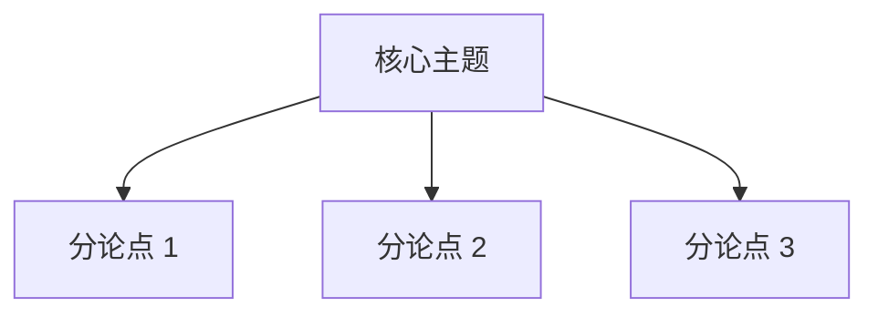

# 《书名》精读笔记

- **作者**：
- **阅读时间**：YYYY-MM-DD ~ YYYY-MM-DD
- **豆瓣 / Goodreads 评分**：
- **个人评级**：⭐⭐⭐⭐⭐
- **核心关键词**：`关键词1` / `关键词2` / `关键词3`

---

## 💡 一句话总结 & 核心心智模型
> 用 1~3 句话总结本书最核心的立论和解决的本质问题。

---

## 🗺️ 知识架构全景

---

## 📌 核心章节要点精析

### 1. 第一部分 / 第一章：xxx
- **核心论点**：
- **论证推导**：
- **关键细节**：

### 2. 第二部分 / 第二章：xxx
- **核心论点**：
- **论证推导**：
- **关键细节**：

---

## 💬 深度摘录与金句
> 原文摘录 1 ...

> 原文摘录 2 ...

---

## 🛠️ 现实工程映射与思考
- **对实际系统设计的启发**：
- **本书观点与局限性/时代背景分析**：
- **后续行动项 (Action Items)**：
  - [ ] 实践应用点 1
  - [ ] 深入研读关联文献/代码
